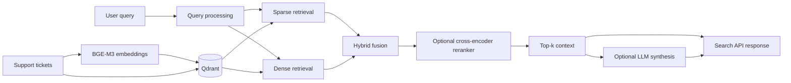

<div align="center">

# LogiStore RAG

### Hybrid enterprise search for support tickets

**BM25 + dense retrieval + reranking + optional LLM synthesis**


</div>

---

## Overview

**LogiStore RAG** is an enterprise-search prototype built around a **hybrid Retrieval-Augmented Generation pipeline** for technical-support tickets.

The project focuses on retrieval quality first: sparse and dense signals are combined, optional cross-encoder reranking improves result ordering, and an LLM can synthesize an answer from the retrieved evidence.

It was developed as an **M2 AI & Data Science project at La Plateforme, Marseille**.

---

## Problem

Support teams often have years of solved tickets, but the knowledge remains difficult to reuse because:

- terminology varies between users and technicians;
- exact keyword search misses semantically similar incidents;
- pure semantic search can overlook highly discriminative technical terms;
- generated answers are difficult to trust without traceable source retrieval.

LogiStore RAG explores a retrieval architecture designed to balance **lexical precision, semantic recall and answer traceability**.

---

## Architecture



---

## Technical stack

| Layer | Technology | Role |
|---|---|---|
| Vector database | **Qdrant** | Self-hosted dense + sparse retrieval |
| Embeddings | **BGE-M3** | Multilingual dense and sparse representations |
| Reranking | **BGE-reranker-v2-m3** | Optional cross-encoder reranking |
| API | **FastAPI** | Search and service endpoints |
| UI | **Streamlit** | Lightweight MVP interface |
| LLM layer | **OpenRouter** | Optional answer synthesis |
| Evaluation | **RAGAS + IR metrics** | Retrieval and generation assessment |

---

## Quick start

### Requirements

- Docker
- Python 3.11+
- `make`

### Install and run

```bash
make install
cp .env.example .env
```

Configure the environment, then start Qdrant:

```bash
make qdrant-up
```

Download and ingest the dataset:

```bash
make download-data
make ingest
```

Launch the API and UI in separate terminals:

```bash
make api
make ui
```

Local services:

```text
API: http://localhost:8000
UI:  http://localhost:8501
```

---

## Evaluation

The project includes a reproducible evaluation pipeline:

```bash
make eval
```

The generated report is written to:

```text
data/evaluation/report.html
```

### Retrieval metrics

- Precision@5
- Recall@10
- NDCG@10
- MRR

### RAG quality

The generation layer can additionally be evaluated with **RAGAS / LLM-as-judge** style checks.

The repository intentionally separates **retrieval evaluation** from **answer-generation evaluation** so improvements can be attributed to the correct stage of the pipeline.

---

## Design choices

### Why hybrid search?

Support tickets contain both natural-language descriptions and highly specific technical identifiers. Dense retrieval captures semantic similarity while sparse retrieval preserves exact lexical signals.

### Why reranking?

The first retrieval stage optimizes candidate recall. A cross-encoder can then spend more compute on a small candidate set to improve final ordering.

### Why optional generation?

The search engine remains useful without an LLM. Generation is treated as an additional layer rather than the foundation of retrieval, which makes the system easier to evaluate and debug.

---

## Project structure

```text
.
├── docs/                       # architecture, research, risk and evaluation notes
├── data/                       # datasets and generated evaluation artifacts
├── src/                        # ingestion, retrieval and application code
├── tests/                      # unit and integration tests
├── .env.example               # configuration template
├── Makefile                   # common development commands
└── README.md
```

See the detailed architecture in:

- [`docs/01_veille_technologique.md`](docs/01_veille_technologique.md)
- [`docs/02_architecture.md`](docs/02_architecture.md)
- [`docs/03_etude_risques.md`](docs/03_etude_risques.md)
- [`docs/04_evaluation_protocole.md`](docs/04_evaluation_protocole.md)

---

## Tests and quality

```bash
make test
make test-int
make lint
```

Integration tests require a running Qdrant instance.

---

## Future directions

Potential extensions include:

- multi-source enterprise ingestion (ERP, CRM, PIM, GED);
- metadata-aware filtering and access control;
- query rewriting and intent routing;
- retrieval observability and error analysis;
- offline benchmark datasets for regression testing;
- citation-aware answer generation.

---

## Author

**Mohamed AHMEDVALL**  
AI & Data Science — La Plateforme, Marseille

---

## License

MIT — academic project.
