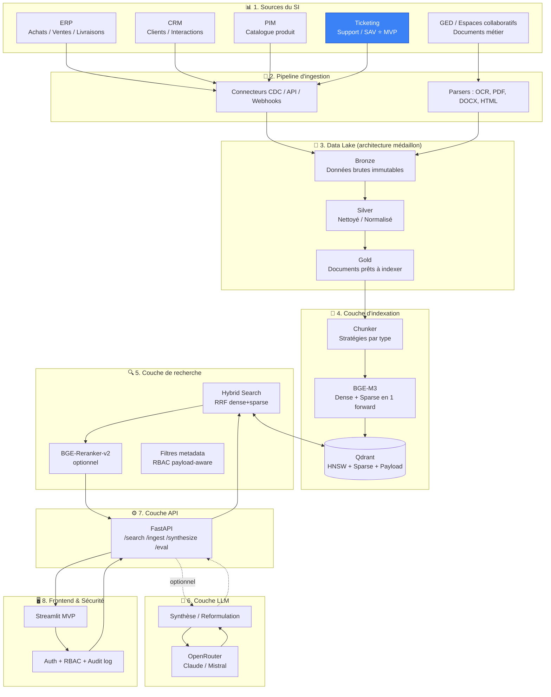

# Architecture cible — Système RAG LogiStore

**Projet RAG-time / LogiStore — M2 IA & Data Science**
**Auteur :** Mohamed AHMEDVALL
**Date :** Mai 2026

---

## 1. Vue d'ensemble

Ce document décrit l'architecture cible du système RAG de LogiStore, depuis les sources progicielles existantes jusqu'à l'interface utilisateur de recherche, en passant par le pipeline d'ingestion, les couches d'indexation, de recherche, de génération et de sécurité. Il sert de référence pour le développement du MVP et fixe la trajectoire d'évolution vers un moteur de recherche d'entreprise généralisé.

L'architecture est pensée selon trois principes directeurs :

**Modularité.** Chaque couche est indépendante et remplaçable. Le moteur d'index, le modèle d'embeddings, le LLM générateur et le frontend peuvent être substitués sans réécriture du reste du système. Cette modularité protège contre l'obsolescence technologique rapide caractéristique du domaine.

**Souveraineté des données.** Aucune donnée métier de LogiStore ne quitte l'infrastructure sans contrôle explicite. Les embeddings sont calculés localement (BGE-M3), l'index est self-hosted (Qdrant), et l'appel à un LLM externe n'intervient que sur des extraits déjà filtrés et anonymisés si nécessaire. Cette posture est dictée par les contraintes RGPD et la sensibilité potentielle des tickets de support.

**Trajectoire incrémentale.** Le MVP est centré sur les tickets de support, mais chaque composant est conçu pour absorber les futures sources (ERP, CRM, PIM, GED) sans refonte. Le pipeline d'ingestion supporte des connecteurs hétérogènes, l'index gère plusieurs collections, et l'API expose des filtres généralisés.

---

## 2. Cartographie du système d'information de LogiStore

Le système d'information cible suppose la présence de cinq grands progiciels métiers et d'un ou plusieurs espaces documentaires :

**ERP (Enterprise Resource Planning).** Gère les flux commerciaux et logistiques : achats, ventes, livraisons, facturation, stocks. Exemples typiques en déploiement français : SAP S/4HANA pour les grands comptes, Odoo ou Dolibarr pour les PME, Microsoft Dynamics 365 pour les ETI. Les données sont structurées, transactionnelles, souvent stockées en base relationnelle (Oracle, SQL Server, PostgreSQL). L'accès se fait par API standard (REST, OData) ou par lecture directe en base avec un compte de service.

**CRM (Customer Relationship Management).** Centralise les informations client : fiches, historiques d'interaction, segmentation, opportunités commerciales. Salesforce reste dominant en France, HubSpot émerge sur le segment PME, Microsoft Dynamics 365 Sales est apprécié dans les écosystèmes Microsoft. Les données combinent structuré (fiches) et semi-structuré (notes, comptes rendus). API REST disponibles partout.

**PIM (Product Information Management).** Référentiel central du catalogue produit : descriptions, caractéristiques techniques, médias, traductions, hiérarchies de familles. Akeneo est le leader open-source en France, Pimcore et Salsify sont des alternatives. Les données sont structurées mais le contenu textuel des fiches produits est riche et exploitable en sémantique.

**Solution de ticketing / SAV.** Gère le cycle de vie des demandes de support : création, qualification, résolution, suivi. Zendesk, Jira Service Management, Freshdesk, Salesforce Service Cloud, ou des solutions open-source comme GLPI. C'est la source prioritaire du MVP : les tickets concentrent un savoir métier dense et réutilisable (descriptions de symptômes, résolutions appliquées, échanges client).

**GED et espaces collaboratifs.** Stockent les documents métier non structurés : procédures, guides techniques, contrats, comptes rendus, FAQ. Souvent un mix de plusieurs outils : SharePoint pour les sites Microsoft, Nuxeo ou Alfresco pour les déploiements open-source, Confluence pour la documentation technique, espaces Drive ou Notion en complément.

**Considérations de déploiement.** LogiStore peut héberger ces progiciels en plusieurs configurations :

- *On-premise* pour les organisations sensibles à la souveraineté ou aux contraintes réglementaires (santé, défense, public).
- *Cloud SaaS* pour la majorité des progiciels modernes (Salesforce, HubSpot, Akeneo Cloud, Zendesk).
- *Hybride* mixant les deux, ce qui complique l'ingestion (latences, authentifications variées, fenêtres de maintenance désynchronisées).

L'architecture du système RAG est agnostique à ces choix : les connecteurs d'ingestion gèrent l'hétérogénéité en amont.

---

## 3. Architecture du système RAG — vue logique

Le système RAG s'articule en huit couches fonctionnelles, organisées de la source au consommateur final :

Le schéma met en évidence le périmètre du MVP (ticketing en surbrillance) tout en représentant les sources futures qui seront intégrées sans refonte.

---

## 4. Détail des couches

### 4.1 Sources et stratégies de connexion

Chaque source impose une stratégie d'extraction différente :

| Source | Type | Stratégie d'ingestion | Fréquence | Volume estimé |
|---|---|---|---|---|
| ERP | Structuré | CDC ou snapshots SQL via compte service | Quotidien (batch) ou temps réel (CDC) | 100 K – 10 M lignes |
| CRM | Structuré + semi | API REST + webhooks pour les events | Temps réel pour events, batch quotidien pour fiches | 10 K – 1 M fiches |
| PIM | Structuré | API REST avec pagination | Quotidien ou sur événement de mise à jour | 1 K – 100 K produits |
| Ticketing | Semi-structuré | API REST + webhooks | Temps quasi-réel (5-15 min) | 100 K – 10 M tickets |
| GED | Non-structuré | Polling, watchers, ou indexation à la demande | Quotidien | 1 K – 100 K documents |

Le **MVP** se concentre sur la dernière colonne, ticketing, avec ingestion batch depuis le dataset Kaggle (200K+ tickets). La logique d'ingestion est cependant générique et accommodera les autres sources sans réécriture.

### 4.2 Pipeline d'ingestion

L'ingestion suit un pattern standard d'architecture médaillon (popularisé par Databricks) :

**Bronze** : copie brute et immutable des données source. Aucune transformation. Sert de référence vérifiable et permet de rejouer les transformations si nécessaire. Stockage parquet ou JSON-Lines sur disque local ou objet S3-compatible (MinIO en self-hosted).

**Silver** : données nettoyées, normalisées, dédupliquées, enrichies de métadonnées techniques (timestamp d'ingestion, hash de contenu, identifiant source). Schéma typé strict (Pydantic ou Pandera) pour garantir la qualité aval. Une ligne en silver = un document logique cohérent (un ticket complet par exemple).

**Gold** : documents prêts à indexer. Contenu textuel consolidé (concaténation propre des champs pertinents), métadonnées normalisées pour le filtrage (catégorie, statut, produit, client, dates), chunks si nécessaire. C'est la couche directement consommée par l'indexeur.

Cette séparation présente plusieurs vertus opérationnelles : on peut rejouer un changement de stratégie de chunking sans réingérer depuis l'ERP, on peut auditer l'origine de toute information indexée, et on isole les responsabilités (équipe data engineering pour bronze/silver, équipe IA pour gold→index).

### 4.3 Stratégie de chunking

Le chunking est le point critique le plus sous-estimé du RAG. Une mauvaise stratégie dégrade la qualité bien plus que le choix du modèle d'embeddings.

**Pour les tickets de support (MVP)** : un ticket complet (subject + description + resolution + commentaires) est traité comme un document indexable unique si sa taille reste sous 8000 tokens (limite de BGE-M3). Pour les tickets longs, on découpe par sections logiques (subject+description = un chunk, chaque commentaire = un chunk), avec conservation du `ticket_id` en metadata pour reconstituer le contexte au moment du retrieval.

**Pour les données structurées (ERP, CRM, PIM, futur)** : sérialisation en « document virtuel » par entité. Un produit du PIM devient un texte structuré du type « Produit : XYZ. Famille : ABC. Description : ... Caractéristiques : ... ». Cette sérialisation est gérée par un mapper par source, versionné pour permettre de réindexer après évolution du schéma.

**Pour les documents non structurés (GED, futur)** : recursive character splitting (LangChain-style) en chunks de 512 à 1024 tokens avec overlap de 50-100 tokens. Pour les documents structurés (PDF avec sections, DOCX avec styles), préférer un splitting respectant la structure (par section, par paragraphe).

Tous les chunks portent un identifiant déterministe (hash du contenu + source) qui permet l'idempotence de la réindexation.

### 4.4 Couche d'indexation : Qdrant

L'index est centralisé dans Qdrant, déployé en self-hosted. Une **collection par domaine** est créée : `tickets_support` pour le MVP, futur `produits_pim`, `clients_crm`, `procedures_ged`, etc. Cette segmentation par collection facilite la gestion des cycles de vie (réindexation indépendante) et le contrôle d'accès.

Chaque point dans Qdrant porte :

- **Vector dense** : embedding BGE-M3 (1024 dimensions, float32).
- **Vector sparse** : représentation sparse BM25-like, également produite par BGE-M3 (économie d'infrastructure : un seul modèle pour deux vecteurs).
- **Payload (métadonnées)** : champs indexés pour filtrage rapide. Pour les tickets : `ticket_id`, `customer_id`, `product`, `category`, `subcategory`, `status`, `priority`, `created_at`, `resolved_at`, `agent_id`, `tags`.
- **Identifiant déterministe** pour l'idempotence.

La configuration HNSW retenue : `M=16`, `ef_construction=200`, `ef_search` ajustable à la requête. Ces valeurs offrent un excellent compromis recall/latence pour des collections de l'ordre de 100K à 10M de points, sans quantization. La quantization scalaire (int8) sera introduite si la collection dépasse 10M de points.

Les filtres payload-aware de Qdrant (l'index intègre les filtres pendant la recherche, et non en post-traitement) sont essentiels pour le RBAC : un utilisateur du service support produit X ne voit que les tickets de ce produit, et cette restriction est intégrée à la recherche sans surcoût significatif.

### 4.5 Couche de recherche

L'API de recherche expose une fonction unique `search(query, filters, options)` qui implémente le pipeline suivant :

1. **Réception et validation** de la requête (Pydantic).
2. **Génération des représentations** : la requête est encodée par BGE-M3 pour produire simultanément le vecteur dense et le vecteur sparse.
3. **Hybrid query Qdrant** : appel à la Query API avec stratégie de fusion RRF (`k=60` standard). Les filtres metadata (RBAC + filtres utilisateur) sont appliqués au niveau du retrieval.
4. **Reranking optionnel** : si la requête est marquée comme « high-stakes » ou si l'utilisateur active explicitement l'option, BGE-reranker-v2-m3 rerank le top-50 pour produire le top-K final. Cette étape ajoute 100-300 ms mais améliore significativement la qualité.
5. **Formatage de la réponse** : top-K résultats avec scores fusion, scores composants (dense, sparse, rerank si applicable), métadonnées, extraits, et explication de pertinence textuelle.

L'explicabilité est première : chaque résultat doit pouvoir être justifié à l'utilisateur (« retrouvé par match lexical sur le terme X et similarité sémantique avec passages Y »).

### 4.6 Couche LLM : synthèse optionnelle

L'usage du LLM est cantonné à un rôle de **synthèse**, jamais de génération autonome. Le pipeline est :

1. L'utilisateur consulte les résultats de recherche.
2. Optionnellement, il clique sur « Synthétiser » pour obtenir un résumé des top-3 ou top-5.
3. Le système construit un prompt structuré contenant uniquement les passages récupérés.
4. Le LLM (Claude Sonnet ou Mistral via OpenRouter) génère une synthèse avec citations explicites aux sources.

Ce design garantit que toute affirmation peut être tracée à un document. L'utilisateur garde le contrôle : pas de génération imposée, pas d'hallucination en sortie de retrieval.

Une **abstraction LLM** (interface `LLMProvider`) permet de switcher vers un déploiement on-premise (Ollama + Mistral local) sans modifier le code applicatif. Cette abstraction est essentielle pour la souveraineté : à terme, LogiStore peut basculer entièrement off-cloud si les exigences l'imposent.

Le **caching** des synthèses (clé : hash de la requête + IDs des passages) évite les appels redondants et stabilise les coûts.

### 4.7 Couche API : FastAPI

Le backend FastAPI expose une API REST minimale :

- `POST /search` : recherche hybride avec filtres.
- `POST /synthesize` : synthèse LLM optionnelle sur un ensemble de résultats.
- `POST /ingest` : déclenchement manuel d'une ingestion (utile pour le MVP, scriptable pour production).
- `GET /collections/{name}/stats` : statistiques de l'index (taille, dernière mise à jour).
- `POST /eval/run` : lancement d'une évaluation contre le golden dataset.
- `GET /health` : healthcheck pour monitoring.

L'authentification est gérée par des tokens (Bearer JWT en cible, simple API key en MVP). Chaque appel est loggué avec utilisateur, requête, résultats retournés et latences (essentiel pour le RGPD : droit à l'effacement, traçabilité des accès aux données personnelles).

### 4.8 Frontend : Streamlit

Le frontend MVP est en Streamlit pour minimiser le temps de mise en place tout en offrant une expérience interactive. L'interface comprend :

- Une **barre de recherche** principale avec auto-suggestions optionnelles.
- Une **sidebar de filtres** : catégorie, produit, statut, dates, client, priorité. Filtres multivaleurs et plages temporelles.
- Une **zone de résultats** en cartes avec score, badge de pertinence (couleurs), extrait surligné, métadonnées.
- Une **vue détail** d'un ticket sélectionné, avec contexte complet.
- Un **toggle « Synthétiser »** déclenchant l'appel LLM optionnel sur les top-3.
- Une **page d'évaluation** affichant les métriques (Precision@K, NDCG, etc.) calculées sur le golden dataset.

Cette architecture Streamlit / FastAPI permet une migration ultérieure vers une SPA React sans refonte du backend.

### 4.9 Sécurité, RBAC et conformité

La sécurité n'est pas une couche ajoutée a posteriori mais une dimension transversale. Quatre lignes de défense :

**Authentification.** Tokens (JWT cible, API key en MVP), expiration configurable, rotation des secrets via variables d'environnement chargées depuis un secret manager (Vault, AWS Secrets Manager, ou .env protégé en MVP). Aucun secret en dur dans le code.

**RBAC payload-aware.** Le contrôle d'accès s'applique au moment du retrieval, pas en post-filtre côté client. Chaque utilisateur a un profil avec des claims (`allowed_products`, `allowed_customers`, `role`), traduits en filtres Qdrant injectés systématiquement. Un utilisateur ne peut techniquement pas accéder à des documents hors de son périmètre.

**Cloisonnement et minimisation.** Avant tout appel au LLM externe, les passages transmis peuvent être filtrés (suppression de PII non nécessaires) via un module de sanitization. Le principe de minimisation RGPD est respecté : seul l'extrait utile est transmis, jamais le document complet sauf nécessité explicite.

**Audit log.** Chaque requête est journalisée (utilisateur, timestamp, query, résultats, synthèse demandée ou non). Conservation 90 jours par défaut, configurable. Permet l'audit et la conformité aux droits d'accès RGPD (article 15) et d'effacement (article 17).

### 4.10 Observabilité

Trois piliers :

- **Logs structurés** (JSON) avec corrélation par request ID. Stack ELK ou Loki en cible.
- **Métriques** exposées au format Prometheus : latence des étapes (embed, search, rerank, LLM), taux d'erreur, volumétrie, hit rate cache. Dashboard Grafana.
- **Tracing** OpenTelemetry sur les requêtes longues pour identifier les goulots.

En MVP, un simple logging Python structuré + un endpoint `/metrics` JSON suffisent.

---

## 5. Intégration future des sources additionnelles

Le MVP couvre les tickets de support. L'extension aux autres sources suit le même schéma logique, avec quelques spécificités :

**ERP → collection `commandes_erp`.** Chaque commande devient un document virtuel sérialisé (client, produits, montants, statut, dates). Le RAG sur l'ERP permet des requêtes type « commandes en retard pour client X » ou « historique des livraisons sur produit Y ». L'ingestion est typiquement batch quotidienne via une vue SQL exposée par l'ERP.

**CRM → collection `clients_crm`.** Fiches clients enrichies des interactions récentes. Permet des requêtes type « clients ayant signalé un problème similaire » ou « historique commercial de tel compte ». Connecteur via API (Salesforce, HubSpot ont tous une API REST).

**PIM → collection `produits_pim`.** Fiches produit avec descriptions, caractéristiques, médias. Permet le « catalogue conversationnel » : trouver un produit par caractéristique floue. Ingestion via API Akeneo ou export régulier.

**GED → collection `documents_ged`.** Documents non structurés. Parsing PDF/DOCX/HTML, OCR si nécessaire, chunking semantic. Permet la recherche dans les procédures, contrats, comptes rendus. Connecteur dépend de la GED utilisée (SharePoint Graph API, Nuxeo REST API, etc.).

**Routing inter-collections.** Un classifieur léger (zero-shot avec un LLM, ou modèle dédié entraîné sur les patterns de requêtes) décide à quelle(s) collection(s) router la requête, et fusionne les résultats inter-sources via RRF. Cette capacité multi-source est ce qui transforme un moteur de recherche par silo en un véritable moteur de recherche d'entreprise.

---

## 6. Trajectoire d'évolution

L'architecture est dimensionnée pour porter trois jalons successifs :

**Jalon 1 — MVP (10 jours).** Tickets support, dataset Kaggle, Qdrant en local, FastAPI + Streamlit, évaluation manuelle sur 30 requêtes. Démontre la faisabilité technique et la valeur métier.

**Jalon 2 — Industrialisation (3 mois).** Connecteurs réels vers ticketing, CRM et PIM. Pipeline d'ingestion automatisé avec orchestrateur (Airflow ou Prefect). Reranking systématique. RBAC complet. Déploiement en environnement de production avec monitoring.

**Jalon 3 — Moteur de recherche d'entreprise (12 mois).** Toutes les sources connectées (ERP, GED). Routing inter-collections. Agentic RAG pour les requêtes complexes. GraphRAG pour les vues analytiques transverses. Migration éventuelle vers un LLM on-premise (Mistral, Llama) pour les usages sensibles.

---

## 7. Synthèse

L'architecture proposée combine pragmatisme et ambition. Pragmatique par le périmètre serré du MVP (tickets uniquement, technologies éprouvées, déploiement local). Ambitieuse par la trajectoire affichée et par les choix structurants : Qdrant pour la pérennité, BGE-M3 pour la souveraineté, RAG hybride pour la robustesse, modularité pour l'évolution. Chaque décision est défendable face à un comité technique et compatible avec les contraintes RGPD applicables au secteur d'activité de LogiStore.
